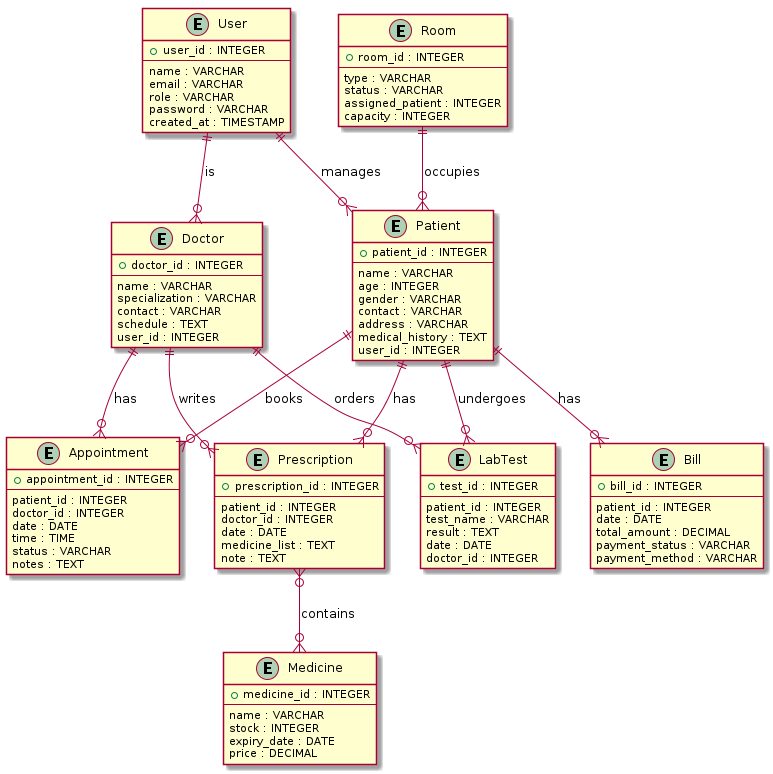
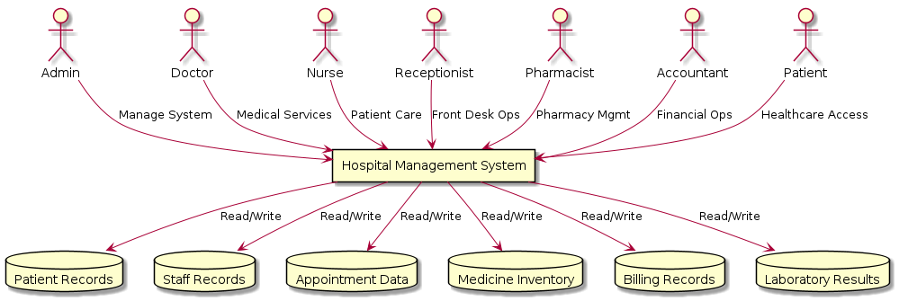

# Hospital Management System (HMS) - Project Presentation

---

## Project Overview

- **Project Title:** Hospital Management System (HMS)
- **Institution:** University Bangladesh
- **Team Members:**
  - Shuvo Mozumder
  - Alamin Sarker
  - Jibon Ray
  - MD. Shakil
  - Naimur Rahman
  - Tarin Mustari
  - MD. Mahedi Ahsan

---

## Introduction

The Hospital Management System (HMS) is designed to streamline hospital operations in Bangladesh, inspired by leading institutions like Ibn Sina, Labaid, and Bardem.

**Objectives:**
- Automate administrative processes
- Improve patient care through digital records
- Enhance operational efficiency
- Ensure data security and compliance

---

## Bangladesh Healthcare Context

Bangladesh's healthcare sector features modern facilities:

- **Ibn Sina Hospital:** Multi-specialty with cardiology, oncology, emergency services
- **Labaid Specialized Hospital:** Known for cardiac care and cancer treatment
- **BIRDEM:** Specialized in diabetes and endocrine disorders

Our HMS aims to emulate these institutions' digital solutions.

---

## System Scope

The HMS covers:

- Patient Management
- Doctor and Staff Management
- Appointment Scheduling
- Medical Records & Prescriptions
- Billing & Payment System
- Pharmacy Management
- Laboratory Management
- Ward/Room Management
- Reporting & Analytics

---

## System Users and Roles

| User Role | Description | Key Activities |
|-----------|-------------|----------------|
| Admin | System management | User management, reports |
| Doctor | Healthcare provider | Appointments, prescriptions |
| Nurse | Patient care | Vital updates, room monitoring |
| Receptionist | Front desk | Patient registration, scheduling |
| Pharmacist | Medicine management | Drug issuance, inventory |
| Accountant | Financial operations | Billing, payment tracking |
| Patient | Service recipient | Appointment booking, bill payment |

---

## System Architecture

- **Frontend:** React.js/Next.js (Responsive web app)
- **Backend:** Django REST Framework/Node.js (API services)
- **Database:** PostgreSQL/MySQL (Data storage)
- **Hosting:** Vercel (Frontend), DigitalOcean/AWS (Backend)

---

## Use Case Diagram

---

## ER Diagram

---

## DFD Level 0

---

## Functional Requirements

- FR1: Patient Registration
- FR2: Appointment Booking
- FR3: Medical Record Management
- FR4: Billing System
- FR5: User Access Control
- FR6: Reporting

---

## Non-Functional Requirements

- **Performance:** <2 seconds load time
- **Security:** Encrypted passwords, JWT authentication
- **Scalability:** Handle 100+ concurrent users
- **Reliability:** 99.9% uptime
- **Usability:** Intuitive dashboards
- **Compatibility:** Cross-browser, mobile responsive

---

## Implementation Plan

1. **Phase 1:** Requirement Analysis (SRS completion)
2. **Phase 2:** System Design (UML diagrams, database schema)
3. **Phase 3:** Development (Frontend & Backend modules)
4. **Phase 4:** Testing (Unit, Integration, System testing)
5. **Phase 5:** Deployment (Production environment)
6. **Phase 6:** Maintenance (Updates and support)

---

## Tools and Technologies

- **Programming:** Python (Django), JavaScript (React)
- **Database:** PostgreSQL
- **Diagrams:** Draw.io, PlantUML
- **Testing:** Postman, Jest, Pytest
- **Version Control:** Git + GitHub
- **Deployment:** Vercel, DigitalOcean, Docker

---

## Deliverables

- Software Requirements Specification (SRS)
- System Design Diagrams (Use Case, ER, DFD)
- Database Schema
- Source Code Repository
- Test Cases and Results
- User Manual
- Deployment Guide

---

## Conclusion

The HMS provides a comprehensive digital solution for Bangladesh's healthcare needs, incorporating best practices from leading hospitals while ensuring compliance with international standards.

**Key Benefits:**
- Improved patient care
- Operational efficiency
- Data security
- Scalable architecture

---

## Thank You!

Questions?

**Contact:** [Team Email/Contact Information]
